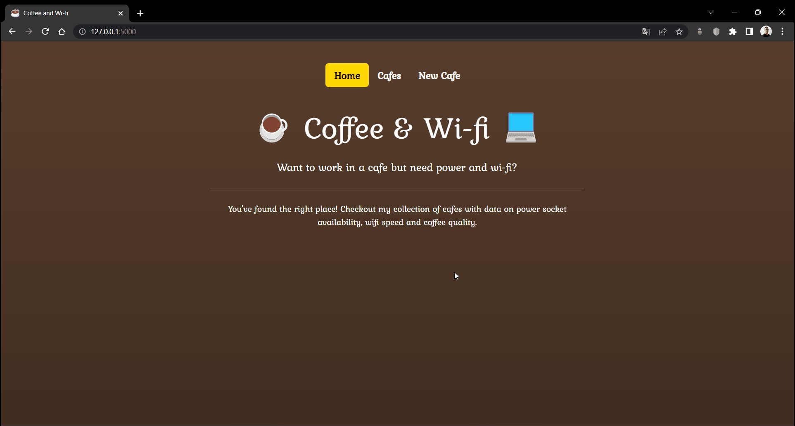

<div align="center">
    <h1>Coffee and Wi-fi ☕</h1>
    <div>
        
    </div>
</div>

## About

This project is a merge of projects from days 62 and 66 of 100 Days of Code.
- Day 62: A coffee shop review site where the user can add their review by filling out a form. This project uses **Flask**, **WTForms** and **Bootstrap** and persists the data to a csv.
- Day 66: REST API to manipulate cafe data.

New:
- Revamped front-end
- Stores the data in an **SQLite** database
- Uses **Peewee** micro ORM instead of **SQLAlchemy** ORM
- Uses **flask_restx** for REST API building and endpoint documentation using the **Swagger UI**
- Uses **Pytest** for testing
- Uses **Dynaconf** for per-environment configuration management (DEV, TEST, PROD)

## Tools used
<div>
    &ensp;
    &ensp;
    &ensp;
    &ensp;
    &ensp;
    &ensp;
    &ensp;
    &ensp;
    &ensp;
    
</div>

## How to install and run

1. Clone the project.
2. Create an `.env` file in the root of the project and define the following variables:
    
    ```properties
    FLASK_ENV="development"
    FLASK_APP="coffee_and_wifi"
    FLASK_SECRET_KEY="your SECRET KEY here"
    ```
    Use the following command to create a **SECRET KEY**: `python -c 'import secrets; print(secrets.token_hex())'`
3. Open the terminal from the project folder and install by running:
    ```
    poetry install
    ```
4. Run the app:
   ```
   flask --debug run
   ```

## How to run the tests

Once you have installed the project, run:
``` 
task test
```

## Author

-   [Igor Ferreira](https://github.com/ig0r-ferreira)

## License

This project is under license from [MIT](LICENSE).